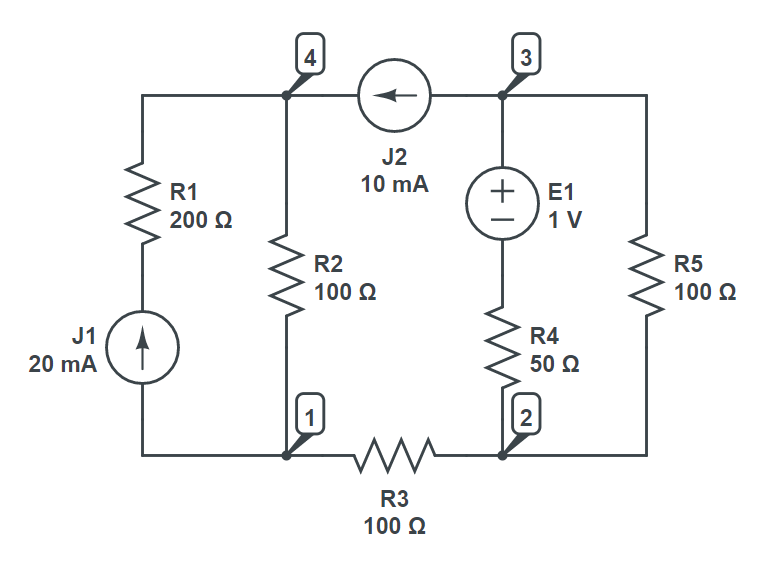

# Circuit Solver
Solve linear electric circuits in code. Light solver powered by polymorphism and automatic differentiation. All you need is Python installed on your machine.

## Brief description
*CircuitSolver* allows you to programmaticaly solve linear circuits. All primitive linear electric components are supported including:
- resistor
- capacitor
- inductor
- impedance
- ideal voltage source
- ideal current source

One can use them to construct an arbitrary circuit. Both DC and AC modes are supported.
## Passive sign convention
When creating and connecting active components (that is voltage and current sources), one must follow [passive sign convention](https://en.wikipedia.org/wiki/Passive_sign_convention). This means that, given the reference direction of voltage and current, EMF or current of those active components which supply power to the rest of the circuit should be taken with negative sign. This boils down to two simple rules:
- EMF of an ideal voltage source is taken with negative sign if and only if its positive pole coincides with negative reference pole.
- Current of an ideal current source is taken with negative sign if and only if its direction is different that reference current direction.
## Example
Consider the following circuit:



Say we are interested in the current going through $R_{4}$. First, we instantiate all the elements.

```python
from CircuitSolver import *

r1 = Resistor('R1', 200)
r2 = Resistor('R2', 100)
r3 = Resistor('R3', 100)
r4 = Resistor('R4', 50)
r5 = Resistor('R5', 100)

e1 = IdealVoltageSource('E1', 1)
j1 = IdealCurrentSource('J1', 20, SIPrefix.Mili)
j2 = IdealCurrentSource('J2', 10, SIPrefix.Mili)
```
Unary operator ~ is overloaded to reverse component's orientation. Take a moment to understand why it has been applied to $E_{1}$. Then, we model the circuit by specifying all the branches and pass them to ```CircuitSolver```'s constructor:
```python
branches = [
    Branch(1, 4, [j1, r1]),
    Branch(1, 4, [r2]),
    Branch(1, 2, [r3]),
    Branch(2, 3, [r4, ~e1]),
    Branch(2, 3, [r5]),
    Branch(3, 4, [j2])
]

circuit = CircuitSolver(branches=branches)
```
Finally, we call method ```solve()``` of ```CircuitSolver```. After that we can inspect currents and voltages across any of constituent components:
```python
circuit.solve()

print(f'Current at {r4.Label}: {r4.current} A')
```
which will print:
```
Current at R4: (0.013333333333350026+0j) A
```
For more examples, you are encouraged to take a look at tests in ```tests/test_circuit_solver.py```.